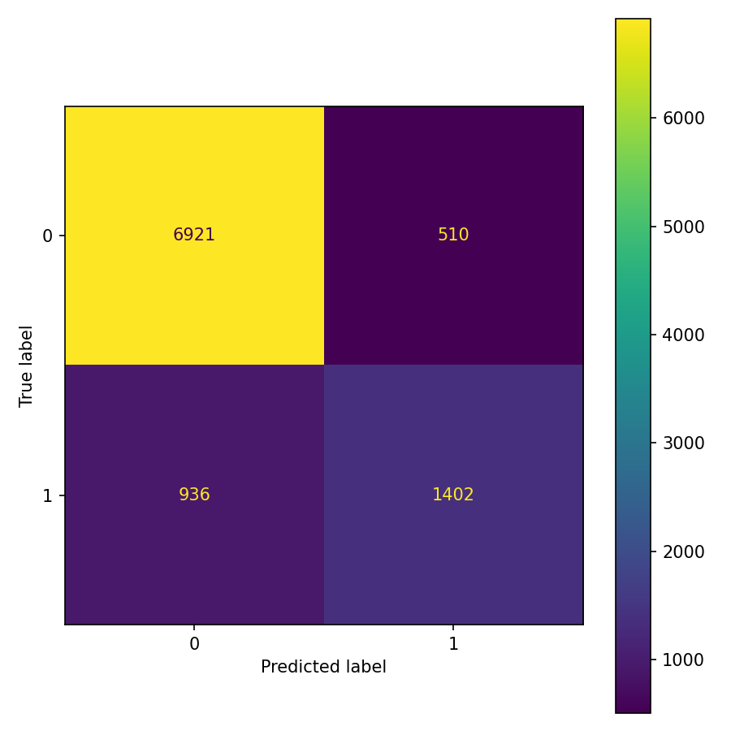

# 🧠 Predicción de Ingresos --- Pipeline MLOps Reproducible (Adult Dataset)


------------------------------------------------------------------------

# 📌 Descripción General

Este proyecto implementa un **pipeline completo de Machine Learning bajo
prácticas MLOps Nivel 1**, utilizando el dataset **Adult (Census Income
Dataset)** del UCI Machine Learning Repository.

El objetivo principal no es únicamente entrenar un modelo, sino
construir un sistema:

-   Reproducible
-   Modular
-   Versionado
-   Automatizado
-   Trazable

Todo el flujo puede ejecutarse con un solo comando:

``` bash
dvc repro
```

------------------------------------------------------------------------

# 🎯 Objetivo del Modelo

Predecir si el ingreso anual de una persona supera los **\$50,000 USD**,
utilizando variables demográficas y laborales.

Se trata de un problema de:

-   **Clasificación supervisada binaria**
-   Dataset con desbalance natural de clases

Clases:

  Clase   Descripción
  ------- ------------------
  0       Ingreso ≤ \$50K
  1       Ingreso \> \$50K

------------------------------------------------------------------------

# 📊 Información del Dataset

  Característica           Valor
  ------------------------ ---------------------------------
  Fuente                   UCI Machine Learning Repository
  Registros                48,842
  Variables                14
  Tipo de problema         Clasificación binaria
  Formato almacenamiento   Parquet

Descarga automática mediante:

``` python
from ucimlrepo import fetch_ucirepo
adult = fetch_ucirepo(id=2)
```

------------------------------------------------------------------------

# ⚙️ Arquitectura del Pipeline MLOps

Pipeline definido en `dvc.yaml`:

    ingest → validate → features → train → evaluate

## 🔹 1️⃣ Ingesta

-   Descarga automática desde UCI
-   Guarda datos en formato **Parquet**
-   Genera resumen de datos

## 🔹 2️⃣ Validación

-   Verificación de esquema
-   Detección de nulos
-   Control de duplicados
-   Validación de rangos

## 🔹 3️⃣ Feature Engineering

-   Limpieza del target
-   Tratamiento de valores faltantes
-   Split estratificado
-   Preprocesamiento:
    -   StandardScaler (numéricas)
    -   OneHotEncoder (categóricas)
-   Serialización del pipeline de transformación

## 🔹 4️⃣ Entrenamiento

Modelo utilizado:

**Logistic Regression** - Solver: saga - max_iter: 3000

## 🔹 5️⃣ Evaluación

-   Métricas sobre conjunto de test
-   Generación automática de matriz de confusión
-   Reporte reproducible

------------------------------------------------------------------------

# 📈 Resultados del Modelo

## 🔹 Métricas Globales

  Métrica    Valor
  ---------- -------
  Accuracy   0.852
  F1 Macro   0.783

## 🔹 Interpretación

-   El modelo logra un desempeño sólido considerando el desbalance del
    dataset.
-   Se observa mejor capacidad para clasificar la clase mayoritaria
    (≤50K).
-   El F1 macro demuestra un equilibrio razonable entre precisión y
    recall en ambas clases.

------------------------------------------------------------------------

# 🖼️ Matriz de Confusión

La siguiente imagen fue generada automáticamente durante el stage
`evaluate`:



## 📌 Interpretación de la Matriz de Confusión

La siguiente matriz resume el desempeño del modelo sobre el conjunto de prueba:

|                | Predicción ≤ 50K | Predicción > 50K |
|---------------|------------------|------------------|
| **Real ≤ 50K** | 6921             | 510              |
| **Real > 50K** | 936              | 1402             |

---

### 🔍 Análisis de los Resultados

- **Verdaderos Negativos (6921):**  
  El modelo clasifica correctamente la mayoría de las personas cuyo ingreso es ≤ $50K.

- **Falsos Positivos (510):**  
  Personas con ingresos ≤ $50K que fueron clasificadas incorrectamente como > $50K.

- **Falsos Negativos (936):**  
  Personas con ingresos > $50K que el modelo no logró identificar correctamente.

- **Verdaderos Positivos (1402):**  
  Casos correctamente clasificados como ingresos > $50K.

---

### 📊 Métricas Derivadas

A partir de la matriz se pueden calcular métricas clave:

- **Precisión (clase >50K):**  
  1402 / (1402 + 510) ≈ **0.73**

- **Recall (clase >50K):**  
  1402 / (1402 + 936) ≈ **0.60**

- **Accuracy global:**  
  (6921 + 1402) / Total ≈ **0.85**

---

### 🎯 Conclusiones Técnicas

1. El modelo presenta un **alto desempeño en la clase mayoritaria (≤50K)**.
2. La clase de ingresos superiores a $50K resulta más compleja de identificar, debido al **desbalance natural del dataset**.
3. Se observa una mayor cantidad de falsos negativos (936) que falsos positivos (510), lo que indica que el modelo tiende a ser conservador al predecir ingresos altos.
4. El desempeño general es sólido, pero podría mejorarse incrementando el recall de la clase >50K mediante:
   - Ajuste del umbral de decisión.
   - Técnicas de balanceo de clases (SMOTE).
   - Optimización de hiperparámetros.
   - Evaluación de modelos alternativos más complejos.

En términos generales, el modelo logra un equilibrio adecuado entre precisión y generalización, manteniendo una **accuracy cercana al 85%**, lo cual es competitivo para este tipo de problema.

------------------------------------------------------------------------

# 🗂️ Estructura del Proyecto

    adult_mlops_consultoria/
    │
    ├── data/
    │   ├── raw/
    │   └── processed/
    │
    ├── src/
    │   ├── ingest.py
    │   ├── validate.py
    │   ├── features.py
    │   ├── train.py
    │   └── evaluate.py
    │
    ├── artifacts/
    ├── models/
    ├── dvc.yaml
    ├── dvc.lock
    ├── requirements.txt
    └── README.md

------------------------------------------------------------------------

# 🔁 Reproducibilidad

## 1️⃣ Crear entorno virtual

``` bash
python -m venv venv
```

## 2️⃣ Activar entorno

Windows:

    venv\Scripts\activate

## 3️⃣ Instalar dependencias

``` bash
pip install -r requirements.txt
```

## 4️⃣ Ejecutar pipeline completo

``` bash
dvc repro
```

Este comando ejecuta automáticamente todas las etapas del pipeline.

------------------------------------------------------------------------

# 🧪 Estrategia de Versionamiento

  Herramienta   Responsabilidad
  ------------- --------------------------
  Git           Código y métricas
  DVC           Datos y modelo entrenado
  dvc.lock      Hashes reproducibles

Esto permite:

-   Reproducibilidad total
-   Trazabilidad de cambios
-   Control de versiones de datos

------------------------------------------------------------------------

# 🛠️ Tecnologías Utilizadas

-   Python
-   pandas
-   scikit-learn
-   matplotlib
-   joblib
-   DVC
-   ucimlrepo
-   git

------------------------------------------------------------------------

# 📌 Conclusiones Técnicas

1.  Se logró implementar un pipeline MLOps completamente automatizado.
2.  El modelo alcanza un desempeño competitivo (\~85% accuracy).
3.  La clase de ingresos altos presenta mayor dificultad debido al
    desbalance.
4.  La estructura modular permite sustituir el modelo sin alterar el
    pipeline.
5.  El uso de DVC garantiza reproducibilidad y versionamiento de datos.

------------------------------------------------------------------------

# 🚀 Posibles Mejoras Futuras

-   Integración con MLflow
-   Optimización de hiperparámetros
-   Modelos más complejos (XGBoost, Random Forest)
-   Balanceo de clases (SMOTE)
-   Implementación de CI/CD

------------------------------------------------------------------------

# 🎓 Contexto Académico

Proyecto desarrollado como ejercicio práctico de:

-   Ingeniería de Machine Learning
-   Automatización de pipelines
-   Principios de MLOps
-   Reproducibilidad científica

------------------------------------------------------------------------

# 👨‍💻 Autor

Juan Pablo Vargas\
Mildreth Diaz\
Universidad Santo Tomás\
Facultad de Estadística\
Proyecto Académico MLOps